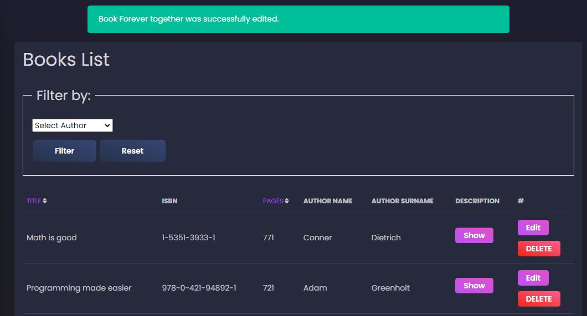
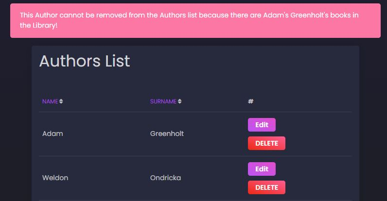
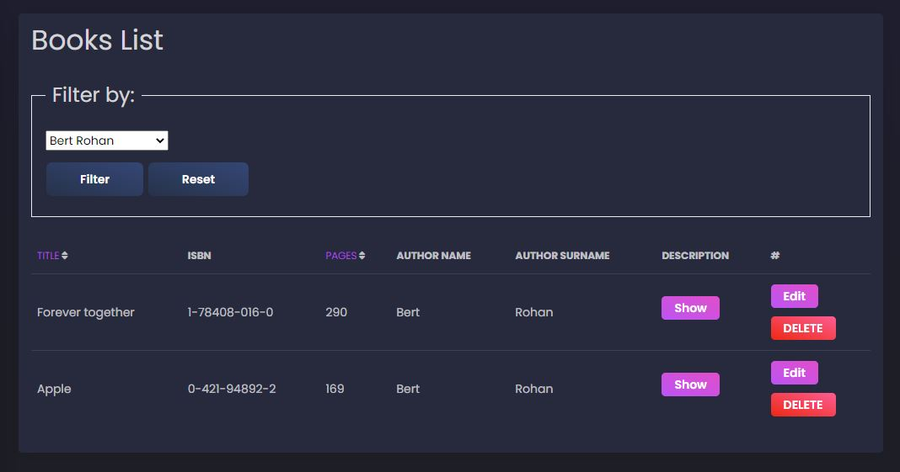

# Exam-project-Library

This is my final Laravel project that I had to defend during the exam at Baltic Institute of Technology. And it was a success! I got the best grade 10/10. Here you can see a part of it:

Authors can be sorted by Name, Surname

There are error and success messages after each correction(add, edit, delete ect.)

Author cannot be deleted if there are some of his Books in the Library

Books can be sorted by Title, Pages and filtered by Author

Authors and Books can be edited

Button "Show" shows info about each book

